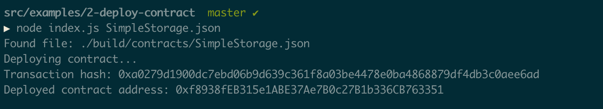
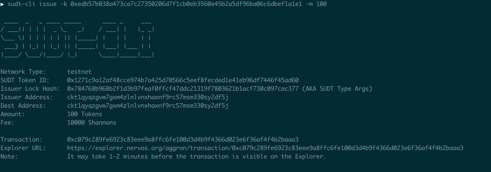
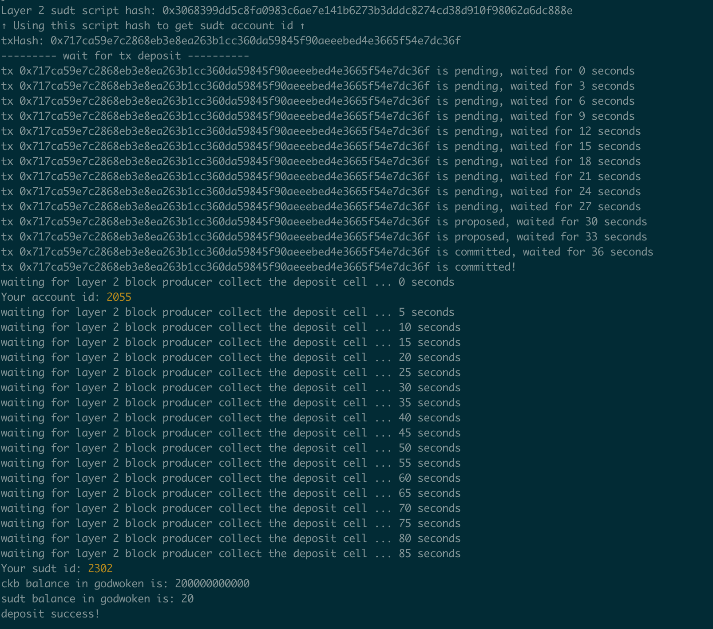
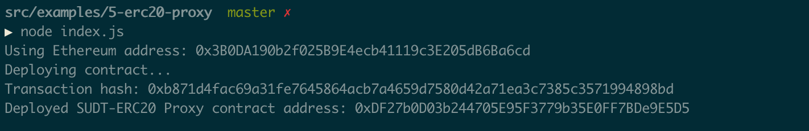
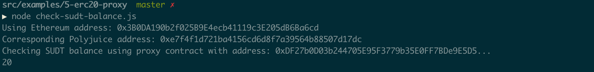
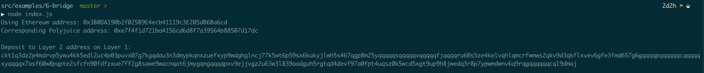

# NervosHackathon

0) Setup A Local CKB Node And CKB Indexer For The Testnet

| Task      | Deliverable |
| ----------- | ----------- |
|Node||
|Indexer||

1) Create A Godwoken Account On The EVM Layer 2 Testnet

| Task      | Deliverable |
| ----------- | ----------- |
|New account created||
|Deposit on Layer2||
|Funded address|[Link to Layer 1 address funded](https://explorer.nervos.org/aggron/address/ckt1qyqzgvw7gxm4zlnlvnxhaxnf9rc57msm330sy2df5j)|

2) Deploy A Simple Ethereum Smart Contract On Polyjuice

| Task      | Deliverable |
| ----------- | ----------- |
|Smart contract deployment||
|TX hash  - contract deployment|0xa0279d1900dc7ebd06b9d639c361f8a03be4478e0ba4868879df4db3c0aee6ad|
|Deployed contract address|0xf8938fEB315e1ABE37Ae7B0c27B1b336CB763351|

3) Issue A Smart Contract Call To The Deployed Smart Contract

| Task      | Deliverable |
| ----------- | ----------- |
|TX hash|0xed0eb0ce1169aa08d43309c51fb8a826ee0f762d4e24b1e78b0d1b16f5ee3ee9|
|Contract address|0xf8938fEB315e1ABE37Ae7B0c27B1b336CB763351|
|ABI| [ABI](images/03/ABI.txt) |

4) Issue An SUDT Token On Layer 1 And Deposit It To Layer 2

| Task      | Deliverable |
| ----------- | ----------- |
|Layer 1 Address|[LINK](https://explorer.nervos.org/aggron/transaction/0xc079c289fe6923c83eee9a8ffc6fe100d3d4b9f4366d023e6f36af4f4b2baaa3)|
|SUDT tokens on Layer 1||
|TX ID|[LINK](https://explorer.nervos.org/aggron/transaction/0xc079c289fe6923c83eee9a8ffc6fe100d3d4b9f4366d023e6f36af4f4b2baaa3)|
|Deposit to Layer 2||
|SUDT ID|2302|

5) Deploy The ERC20 Proxy Contract For The Deposited SUDT

| Task      | Deliverable |
| ----------- | ----------- |
|Deploy smart contract||
|Address of the ERC20 Proxy Contract|0xDF27b0D03b244705E95F3779b35E0FF7BDe9E5D5|
|SUDT balance check||
|Ethereum address checked|0x3B0DA190b2f025B9E4ecb41119c3E205dB6Ba6cd|

6) Use Force Bridge To Deposit Tokens From Ethereum To Polyjuice

| Task      | Deliverable |
| ----------- | ----------- |
|Generated Deposit Receiver Address||
|Deposit Receiver Address|ckt1q3dz2p4mdrvp5ywu4kk5edl2uc4p03puvx07g7kgqdau3n3dmypkqnxzuefxyp9wdghglncj77k5wt6p59sx6kukyjlwh5s467qgp8m25yqqqqqsqqqqqvqqqqqfjqqqqru60s5ze4kelvqhlqmcrfwmws2qkv9d3qkflxvev6gfe3fmd657g6gqqqqpqqqqqqcqqqqqxyqqqqx7asf60w8pqpte2sfcfn90fdfzxue7ff2g8sawe9wacnqat6jmygqngqqqqpxv9ejjvgz2u63w3l839aadguh5rgtqd4devf97a0fpt4uqsz0k5wcd5xgt9up9h8jwedq3r8p7ypwmdwnv6q9rqgqqqqqqcql9dmaj|
|Ethereum address used to generate the Deposit Receiver Address|0x3B0DA190b2f025B9E4ecb41119c3E205dB6Ba6cd|
|Etherscan explorer link|[LINK](https://rinkeby.etherscan.io/tx/0xba57166b0bf29e557440676bc2d1f398ede56baf6084748e68fdbe68bcac8401)|
|Nervos explorer link|[LINK](https://explorer.nervos.org/aggron/transaction/0xcb0114633d8ec9726e391381a7d535aa4bac047a40830a6147c73ae60800428e)|

7) Port An Existing Ethereum DApp To Polyjuice

8) Modify The Ported DApp So It Supports Ethereum Assets Via Force Bridge

9) Initiate Withdrawal Process From The Layer 2 Back To Layer 1

10) Complete Withdrawal Process By Unlocking The Funds
