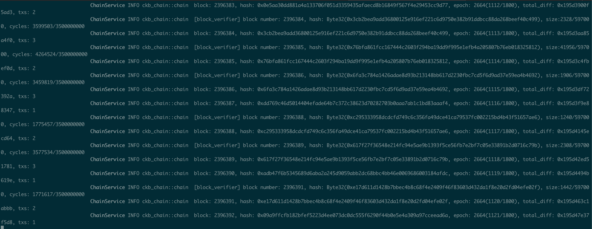
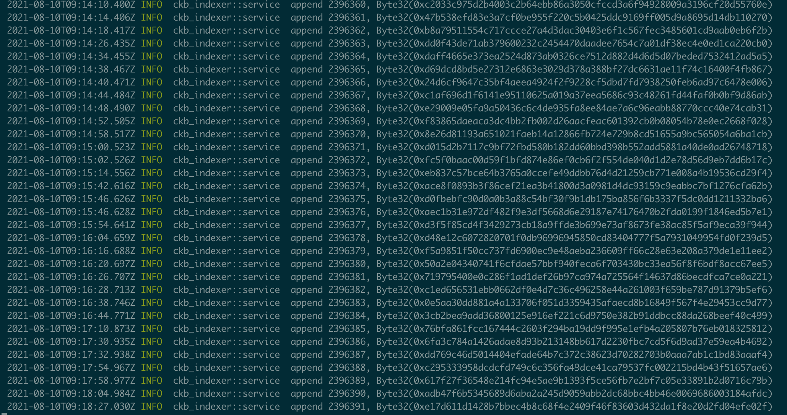
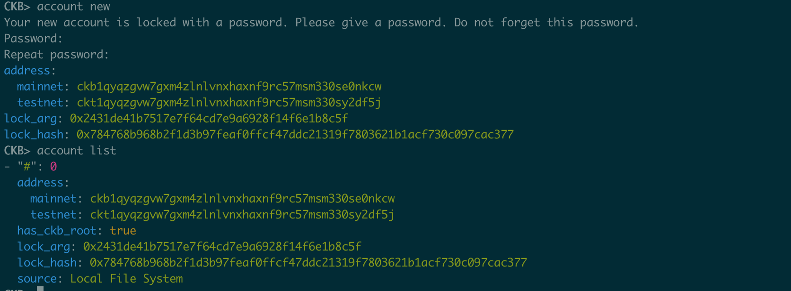
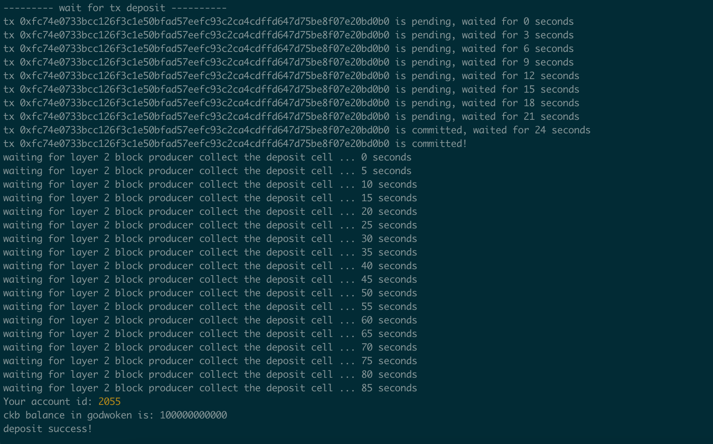

# NervosHackathon

0) Setup A Local CKB Node And CKB Indexer For The Testnet

1) Create A Godwoken Account On The EVM Layer 2 Testnet
New Account created

Deposit on Layer2

[Link to Layer 1 address funded](https://explorer.nervos.org/aggron/address/ckt1qyqzgvw7gxm4zlnlvnxhaxnf9rc57msm330sy2df5j)

2) Deploy A Simple Ethereum Smart Contract On Polyjuice

3) Issue A Smart Contract Call To The Deployed Smart Contract

4) Issue An SUDT Token On Layer 1 And Deposit It To Layer 2

5) Deploy The ERC20 Proxy Contract For The Deposited SUDT

6) Use Force Bridge To Deposit Tokens From Ethereum To Polyjuice

7) Port An Existing Ethereum DApp To Polyjuice

8) Modify The Ported DApp So It Supports Ethereum Assets Via Force Bridge

9) Initiate Withdrawal Process From The Layer 2 Back To Layer 1

10) Complete Withdrawal Process By Unlocking The Funds
